# Architecture Complète HyperZen - Flowchart Mermaid

Ce document contient le flowchart complet de l'architecture du projet HyperZen.

## Code Source Mermaid

```mermaid
graph TB
    subgraph "Interface Utilisateur"
        Login[Page Login]
        AdminDash[Dashboard Admin]
        EleveDash[Portail Élève]
        ProfDash[Espace Enseignants]
    end

    subgraph "Authentification & Sécurité"
        Auth[Supabase Auth]
        RLS[Row Level Security]
        Roles[user_roles]
        PasswordGuard[PasswordGuard]
        MaintenanceGuard[MaintenanceGuard]
        AuditLog[Audit Logs]
    end

    subgraph "Modules Administratifs"
        Eleves[Gestion Élèves]
        Dossiers[Dossiers Scolarité]
        Echeances[Échéances]
        Reglements[Règlements]
        Tickets[Support Tickets]
        Justificatifs[Justificatifs]
        Relances[Relances]
        Anomalies[Détection Anomalies]
        Rapports[Rapports & Stats]
        Utilisateurs[Gestion Utilisateurs]
        Parametres[Paramètres]
        Migration[Migration Année]
    end

    subgraph "Fonctionnalités Élèves"
        ProfilEleve[Mon Profil]
        MesEcheances[Mes Échéances]
        MesReglements[Mes Règlements]
        MesJustifs[Mes Justificatifs]
        MesTickets[Mes Tickets]
        MesRecus[Mes Reçus]
    end

    subgraph "Base de Données Supabase"
        DB_Eleves[(eleves)]
        DB_Dossiers[(dossiers_scolarite)]
        DB_Echeances[(echeances)]
        DB_Reglements[(reglements)]
        DB_Tickets[(tickets)]
        DB_Justifs[(justificatifs)]
        DB_Relances[(relances)]
        DB_Anomalies[(anomalies)]
        DB_Recus[(recus)]
        DB_Imports[(imports)]
        DB_AuditLogs[(audit_logs)]
        DB_Profiles[(profiles)]
        DB_UserRoles[(user_roles)]
        DB_Risques[(risques_financiers)]
        DB_Preferences[(preferences_notifications)]
    end

    subgraph "Edge Functions"
        EF_CreerCompte[creer-compte-eleve]
        EF_EnvoyerIds[envoyer-identifiants-eleve]
        EF_GenererEch[generer-echeances-auto]
        EF_SyncEch[synchroniser-echeance-reglement]
        EF_GenererRecu[generer-recu-pdf]
        EF_EnvoyerEmail[envoyer-notification-email]
        EF_EnvoyerRelances[envoyer-relances-retard]
        EF_TraiterRelances[traiter-relances-automatiques]
        EF_NotifEcheance[notifier-echeance-proche]
        EF_NotifPaiement[notifier-confirmation-paiement]
        EF_ParseImport[parse-import]
        EF_GetEleveEmail[get-eleve-email]
        EF_AdminGerer[admin-gerer-utilisateur]
        EF_SupprimerEleve[supprimer-eleve-complet]
        EF_RepairEleves[repair-eleves]
        EF_NettoyerBase[nettoyer-base-complete]
        EF_SyncSheets[sync-google-sheets]
    end

    subgraph "Flux de Données Principaux"
        Wizard[Wizard Ajout Élève]
        Import[Import CSV]
        Calculs[Calculs Financiers]
        Sync[Synchronisation]
    end

    subgraph "Automatisation"
        Auto_Relances[Relances Auto]
        Auto_Echeances[Génération Échéances]
        Auto_Notifs[Notifications Auto]
        GoogleSheets[Google Sheets Integration]
        HubSpot[HubSpot Integration]
    end

    %% Flux Authentification
    Login -->|Admin| Auth
    Login -->|Élève| Auth
    Login -->|Enseignant| Auth
    Auth --> Roles
    Auth --> RLS
    Auth --> PasswordGuard
    PasswordGuard --> MaintenanceGuard

    %% Flux Admin
    MaintenanceGuard -->|Admin| AdminDash
    AdminDash --> Eleves
    AdminDash --> Dossiers
    AdminDash --> Echeances
    AdminDash --> Reglements
    AdminDash --> Tickets
    AdminDash --> Justificatifs
    AdminDash --> Relances
    AdminDash --> Anomalies
    AdminDash --> Rapports
    AdminDash --> Utilisateurs
    AdminDash --> Parametres
    AdminDash --> Migration
    AdminDash --> AuditLog

    %% Flux Élève
    MaintenanceGuard -->|Élève| EleveDash
    EleveDash --> ProfilEleve
    EleveDash --> MesEcheances
    EleveDash --> MesReglements
    EleveDash --> MesJustifs
    EleveDash --> MesTickets
    EleveDash --> MesRecus

    %% Flux Enseignants
    MaintenanceGuard -->|Enseignant| ProfDash

    %% Connexions Base de Données - Élèves
    Eleves <--> DB_Eleves
    Wizard --> DB_Eleves
    Wizard --> DB_Dossiers
    Wizard --> EF_CreerCompte
    EF_CreerCompte --> DB_Profiles
    EF_CreerCompte --> DB_UserRoles
    EF_EnvoyerIds --> DB_Eleves

    %% Connexions Base de Données - Dossiers
    Dossiers <--> DB_Dossiers
    DB_Dossiers --> Calculs

    %% Connexions Base de Données - Échéances
    Echeances <--> DB_Echeances
    MesEcheances <--> DB_Echeances
    EF_GenererEch --> DB_Echeances
    Auto_Echeances --> EF_GenererEch

    %% Connexions Base de Données - Règlements
    Reglements <--> DB_Reglements
    MesReglements <--> DB_Reglements
    DB_Reglements --> EF_SyncEch
    EF_SyncEch --> DB_Echeances
    DB_Reglements --> EF_GenererRecu
    EF_GenererRecu --> DB_Recus
    DB_Reglements --> EF_NotifPaiement

    %% Connexions Base de Données - Tickets
    Tickets <--> DB_Tickets
    MesTickets <--> DB_Tickets

    %% Connexions Base de Données - Justificatifs
    Justificatifs <--> DB_Justifs
    MesJustifs <--> DB_Justifs

    %% Connexions Base de Données - Relances
    Relances <--> DB_Relances
    DB_Relances --> EF_EnvoyerRelances
    Auto_Relances --> EF_TraiterRelances
    EF_TraiterRelances --> DB_Relances
    EF_TraiterRelances --> EF_EnvoyerEmail

    %% Connexions Base de Données - Anomalies
    Anomalies <--> DB_Anomalies
    Calculs --> DB_Anomalies
    DB_Risques --> Anomalies

    %% Connexions Base de Données - Audit
    AuditLog <--> DB_AuditLogs

    %% Connexions Base de Données - Profil
    ProfilEleve <--> DB_Profiles
    Utilisateurs <--> DB_Profiles
    Utilisateurs <--> DB_UserRoles

    %% Import & Export
    Import --> EF_ParseImport
    EF_ParseImport --> DB_Imports
    EF_ParseImport --> DB_Eleves
    EF_ParseImport --> DB_Dossiers

    %% Notifications
    Auto_Notifs --> EF_NotifEcheance
    EF_NotifEcheance --> DB_Echeances
    EF_NotifPaiement --> EF_EnvoyerEmail
    DB_Preferences --> EF_NotifEcheance
    DB_Preferences --> EF_NotifPaiement

    %% Gestion Utilisateurs
    EF_AdminGerer --> DB_Profiles
    EF_AdminGerer --> DB_UserRoles
    EF_SupprimerEleve --> DB_Eleves
    EF_SupprimerEleve --> DB_Dossiers
    EF_SupprimerEleve --> DB_Echeances
    EF_SupprimerEleve --> DB_Reglements
    EF_RepairEleves --> DB_Eleves

    %% Intégrations
    GoogleSheets --> EF_SyncSheets
    EF_SyncSheets --> DB_Eleves
    HubSpot --> DB_Eleves

    %% Migration
    Migration --> DB_Dossiers
    Migration --> DB_Echeances

    %% Rapports
    Rapports --> DB_Reglements
    Rapports --> DB_Echeances
    Rapports --> DB_Dossiers
    Rapports --> DB_Eleves

    %% Reçus
    MesRecus <--> DB_Recus

    %% Nettoyage
    EF_NettoyerBase --> DB_Eleves
    EF_NettoyerBase --> DB_Dossiers
    EF_NettoyerBase --> DB_Echeances
    EF_NettoyerBase --> DB_Reglements

    %% Calculs
    Calculs --> DB_Echeances
    Calculs --> DB_Reglements
    Calculs --> DB_Dossiers

    style Login fill:#ffd700
    style AdminDash fill:#ffd700
    style EleveDash fill:#00d9ff
    style ProfDash fill:#ff10f0
    style Auth fill:#ff6b6b
    style RLS fill:#ff6b6b
    style DB_Eleves fill:#4ecdc4
    style DB_Dossiers fill:#4ecdc4
    style DB_Echeances fill:#4ecdc4
    style DB_Reglements fill:#4ecdc4
```

## Légende

- **Jaune** : Interfaces utilisateur principales
- **Cyan** : Portail élève
- **Magenta** : Espace enseignants
- **Rouge** : Sécurité et authentification
- **Turquoise** : Tables de base de données

## Notes

Ce flowchart représente l'architecture complète du système HyperZen incluant :
- Les 3 interfaces utilisateur (Admin, Élève, Enseignant)
- Le système d'authentification et de sécurité
- Les 12 modules administratifs
- Les 6 fonctionnalités élèves
- Les 15 tables de base de données
- Les 17 edge functions
- Les flux d'automatisation et intégrations
